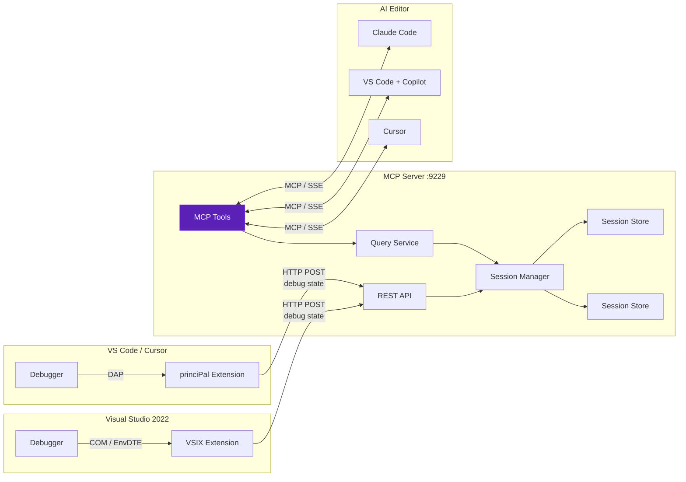

# princiPal

A principal engineer in your pocket. princiPal bridges your Visual Studio 2022 debugger to AI-powered editors (VS Code, Cursor, Claude Code) via the [Model Context Protocol](https://modelcontextprotocol.io/), giving you an always-available expert that understands your runtime state and helps you reason through complex behavior.

### Features

- ✅ **Live debug state streaming**: locals, call stack, and source context pushed on every breakpoint hit
- ✅ **Breakpoint history & execution flow**: rolling snapshots with diffs across breakpoints
- ✅ **Multi-session support**: debug multiple VS solutions simultaneously and query any by name
- ✅ **Self-managed server**: the VSIX bundles and auto-starts the MCP server; idle watchdog handles shutdown
- ✅ **Token-efficient output**: compact formatting designed for LLM consumption
- ✅ **11 MCP tools**: from `get_locals` to `explain_execution_flow`, purpose-built for AI-assisted debugging

## How It Works



**On every breakpoint hit**, the extension reads debugger state through the VS COM model and pushes it to the MCP server. The server stores snapshots in a rolling history and exposes them as MCP tools that any compatible editor can call.

The VSIX bundles the server as a self-contained executable. Install the extension and everything runs automatically.

## Use Cases

**AI-assisted breakpoint debugging.** Step through breakpoints in VS while Claude Code or Cursor explains each state, identifies patterns in variable changes, and suggests what to investigate next.

**Execution flow analysis.** Set breakpoints in a loop or recursive function, step through several iterations, then ask your AI editor to `explain_execution_flow` to see how state evolved across all snapshots with diffs highlighted.

**Multi-session debugging.** Debug multiple VS solutions simultaneously. Each VS instance registers its own session; AI tools can query any of them by name.

**Bug root-cause analysis.** Hit a breakpoint where something is wrong, ask the AI to `explain_current_state`, and get an instant read on locals, call stack context, and surrounding source code without copy-pasting anything.

## Quick Start

### 1. Install the VSIX

Build and install into Visual Studio 2022:

```bash
dotnet build src/PrinciPal.VsExtension -c Release
# Install the .vsix from: src/PrinciPal.VsExtension/bin/Release/PrinciPal.VsExtension.vsix
```

The extension auto-starts the MCP server when you open a solution (configurable under **Tools → Options → princiPal**).

### 2. Configure Your Editor

Add to `~/.claude.json` (Claude Code) or your editor's MCP settings:

```json
{
  "mcpServers": {
    "princiPal": {
      "url": "http://localhost:9229/"
    }
  }
}
```

### 3. Debug

1. Open a project in Visual Studio and start debugging
2. Hit a breakpoint
3. In your AI editor, ask about the debug state:

```
> What does the current debug state look like? Why might `result` be null here?
```

The AI calls MCP tools behind the scenes to read your locals, call stack, and source context.

## MCP Tools

| Tool | Description |
|---|---|
| `list_sessions` | List all connected VS debugging sessions |
| `get_debug_state` | Full state: location, locals, call stack |
| `get_locals` | Local variables with types, values, nested members |
| `get_call_stack` | Stack frames with file paths and line numbers |
| `get_source_context` | ~30 lines of source around the breakpoint |
| `get_breakpoints` | All breakpoints with conditions and hit counts |
| `get_expression_result` | Result of the last Watch/Immediate expression |
| `explain_current_state` | Combined source + locals + stack, ideal for AI |
| `get_breakpoint_history` | Summary of all captured snapshots |
| `get_snapshot` | Full state for a specific snapshot by index |
| `explain_execution_flow` | All snapshots as an execution trace with diffs |

## Architecture

```
src/
  PrinciPal.Domain/            # Value objects: DebugState, LocalVariable, StackFrameInfo, etc.
  PrinciPal.Common/            # Result<T>/Option<T> monads, typed errors
  PrinciPal.Application/       # IDebugQueryService, ISessionManager, CompactFormatter
  PrinciPal.Infrastructure/    # SessionManager, DebugQueryService, ThreadSafeDebugStateStore
  PrinciPal.Server/            # ASP.NET Core host, MCP tool definitions, Quartz idle watchdog
  PrinciPal.VsExtension/       # VS 2022 VSIX: COM/DTE adapters, HTTP publisher
  PrinciPal.VsCodeExtension/   # VS Code/Cursor: TypeScript, DAP-based, same HTTP API
```

### Key Design Decisions

**Adapter + Coordinator pattern.** The extension isolates COM complexity behind `IDebuggerReader` and HTTP behind `IDebugStatePublisher`. A `DebugEventCoordinator` orchestrates reads and publishes, making the core logic testable without VS running.

**Ambassador pattern for shutdown.** The extension never force-kills the server. It deregisters its session and detaches. The server's Quartz idle watchdog is the sole authority on shutdown, self-terminating after a grace period when all sessions disconnect.

**Rolling snapshot history.** Each breakpoint hit is stored as a timestamped snapshot (up to 50 by default). Tools like `explain_execution_flow` diff consecutive snapshots to show how state changed across breakpoints.

**Token-efficient formatting.** Output is formatted as `name:type=value` with dot-notation for nesting, designed to minimize token usage when consumed by LLMs.

## Building & Testing

```bash
dotnet build                # Build all projects (including npm install + tsc for VS Code extension)
dotnet test                 # Run .NET tests
dotnet build -c Release     # Release build (bundles server into both VSIX packages)
```

### Local Development

**Debug mode.** Extensions use `dotnet run` against the sibling `PrinciPal.Server` project via a `.devproject` marker file. No bundled exe needed.

**Release mode.** Both extension csproj files `dotnet publish` the server as a self-contained exe and package it into their respective VSIX outputs.

#### VS 2022 Extension

In Visual Studio, multi-start the **Server** + **VsExtension** projects in Debug. The extension launches the VS Experimental Instance with the VSIX loaded.

#### VS Code / Cursor Extension

```bash
cd src/PrinciPal.VsCodeExtension
npm install && npm run compile    # or: dotnet build
```

Open the `src/PrinciPal.VsCodeExtension` folder in VS Code and press **F5** to launch an Extension Development Host with the extension loaded. Start any debug session in that window to trigger the extension.

Both extensions share port 9229 and coordinate via a lock file. Whichever starts first launches the server; the other reuses it.

#### Running TS Tests

```bash
cd tests/unit/PrinciPal.VsCodeExtension.Tests
npm ci && npm test    # 26 Jest tests
```

## License

This project is licensed under the [GNU General Public License v3.0](LICENSE). Any distribution or derivative work must also be released under GPLv3.
